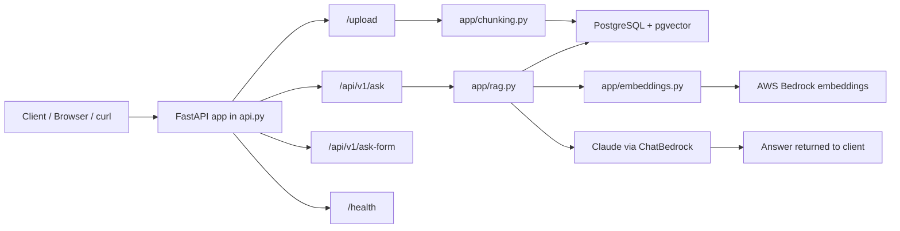
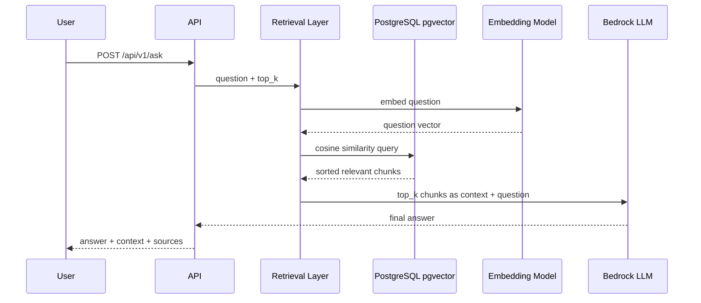
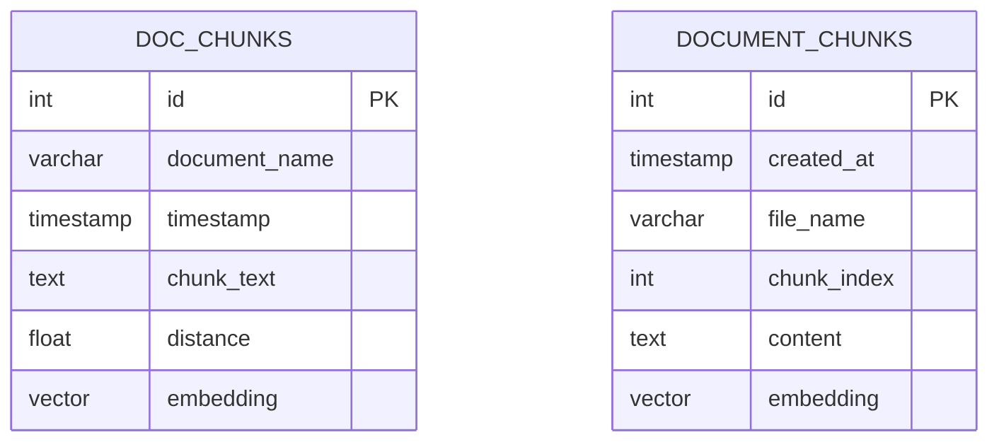
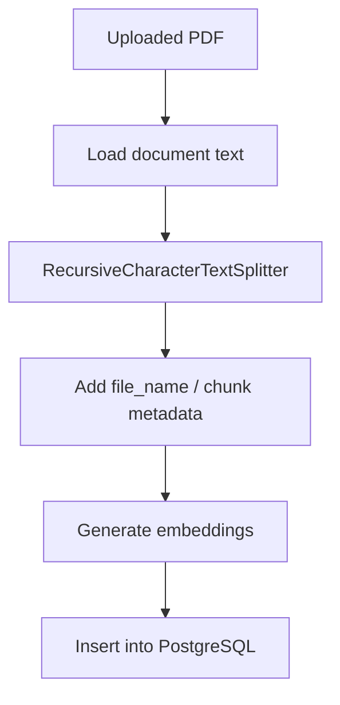

# Document QA + Loader API

This project is a FastAPI-based document ingestion and question answering system built around pgvector and AWS Bedrock.

The application now uses a single entry point in `api.py`, where the upload and QA routes are exposed together. The ingestion and retrieval logic is separated into focused modules under `app/`.

## Overview

The workflow is:

1. A PDF is uploaded through `/upload`
2. The file is chunked and stored in PostgreSQL
3. Each chunk is embedded with an AWS Bedrock embedding model
4. A user question is embedded and compared against stored vectors
5. The best matching chunks are gathered and passed as context to Claude through Bedrock
6. The final answer is returned to the client

## System architecture



## Application structure

```text
.
├── api.py                     # single FastAPI entry point
├── app/
│   ├── __init__.py
│   ├── chunking.py            # PDF chunking and ingestion logic
│   ├── db_client.py           # PostgreSQL connection and inserts
│   ├── embeddings.py          # Bedrock embedding helper
│   ├── rag.py                 # retrieval + answer generation logic
│   └── main.py                # older project utility
├── docker/
│   ├── create_table.sql       # pgvector schema setup
│   ├── docker-compose.db.yml  # Postgres container
│   ├── docker-compose.loader.yml
│   ├── Dockerfile.loader
│   └── ...
├── infrastructure/
├── model_files/
├── src/
├── tests/
├── pyproject.toml
├── README.md
├── notes.txt
└── terraform.tfstate
```

## API endpoints

### GET /health

Returns service health status.

```bash
curl http://localhost:8000/health
```

### POST /upload

Uploads a PDF, processes it with the chunking pipeline, and stores chunks in the database.

```bash
curl -X POST "http://localhost:8000/upload" \
  -F "file=@sample.pdf" \
  -F "distance=10"
```

Example response:

```json
{
  "status": "success",
  "filename": "sample.pdf",
  "distance": 10.0
}
```

### POST /api/v1/ask

Queries pgvector for the most relevant chunks and answers the question using the retrieved context.

```bash
curl -X POST "http://localhost:8000/api/v1/ask" \
  -H "Content-Type: application/json" \
  -d '{
    "question": "What is the key requirement in this document?",
    "top_k": 5
  }'
```

### POST /api/v1/ask-form

Same as the JSON route, but accepts form input.

```bash
curl -X POST "http://localhost:8000/api/v1/ask-form" \
  -F "question=What is the key requirement in this document?" \
  -F "top_k=5"
```

## RAG retrieval flow



## Database schema

The project stores chunk vectors in the `doc_chunks` table and uses pgvector similarity search.



## Storage and query behavior

The active retrieval table is `doc_chunks`.

Each row contains:

- `id` — primary key
- `document_name` — source file name
- `timestamp` — ingestion time
- `chunk_text` — chunk content
- `distance` — optional metadata field
- `embedding` — vector representation from Bedrock

The retrieval process does the following:

- embeds the incoming question
- runs a vector similarity search against the stored embeddings
- orders results by distance or cosine similarity
- sends the highest-ranked chunks as contextual input to the LLM
- keeps the relevant context ordered from strongest match to weaker match

## Chunking behavior

The project uses the chunking pipeline in `app/chunking.py` to split PDFs into semantically manageable blocks.



## Local development

### Requirements

- Python 3.13+
- Docker and Docker Compose
- PostgreSQL with pgvector enabled
- AWS Bedrock access and valid credentials

### Install dependencies

```bash
pip install -e .
```

Or with uv:

```bash
uv sync
```

### Start the database

```bash
cd docker
docker compose -f docker-compose.db.yml up -d
```

### Start the API

From the project root:

```bash
uvicorn api:app --host 0.0.0.0 --port 8000 --reload
```

Then open:

- `http://localhost:8000/docs`
- `http://localhost:8000/health`

## Environment variables

### PostgreSQL

```bash
POSTGRES_HOST=localhost
POSTGRES_PORT=5433
POSTGRES_USER=postgres
POSTGRES_PASSWORD=postgres
POSTGRES_DB=postgres
```

### AWS / Bedrock

```bash
AWS_REGION=eu-central-1
AWS_DEFAULT_REGION=eu-central-1
AWS_ACCESS_KEY_ID=...
AWS_SECRET_ACCESS_KEY=...
AWS_EMBEDDING_MODEL=amazon.titan-embed-text-v2:0
```

## Docker configuration

The loader container is configured to run the unified app entry point.

```yaml
services:
  loader-api:
    build:
      context: ..
      dockerfile: docker/Dockerfile.loader
    ports:
      - "8000:8000"
    command: uvicorn api:app --host 0.0.0.0 --port 8000
```

## Notes

- The old split entry-point files were removed in favor of the single app module `api.py`.
- Business logic is organized into individual modules for easier reuse and maintenance.
- Retrieval is grounded in stored vector data and is designed to keep the most relevant context near the start of the prompt.

## Summary

This repository combines PDF ingestion, chunking, embedding generation, pgvector storage, and Bedrock-powered RAG to create a lightweight document QA system with a clean single-app FastAPI interface.
